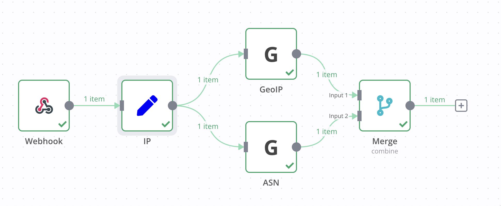

# n8n-nodes-geoip

This is an n8n community node for looking up geo info for an IP.

[n8n](https://n8n.io/) is a [fair-code licensed](https://docs.n8n.io/reference/license/) workflow automation platform.

- [Installation](#installation)
  - [Community Nodes (Recommended)](#community-nodes-recommended)
  - [Manual installation](#manual-installation)
- [Compatibility](#compatibility)
- [Example Workflow](#example-workflow)
- [Resources](#resources)
- [License](#license)

## Installation

Follow the [installation guide](https://docs.n8n.io/integrations/community-nodes/installation/) in the n8n community nodes documentation.

### Community Nodes (Recommended)

For users on n8n v0.187+, your instance owner can install this node from [Community Nodes](https://docs.n8n.io/integrations/community-nodes/installation/).

1. Go to **Settings > Community Nodes**.
2. Select **Install**.
3. Enter `n8n-nodes-geoip` in **Enter npm package name**.
4. Agree to the [risks](https://docs.n8n.io/integrations/community-nodes/risks/) of using community nodes: select **I understand the risks of installing unverified code from a public source**.
5. Select **Install**.

After installing the node, you can use it like any other node. n8n displays the node in search results in the **Nodes** panel.

### Manual installation

To get started install the package in your n8n root directory:

`npm install n8n-nodes-geoip`

For Docker-based deployments add the following line before the font installation command in your [n8n Dockerfile](https://github.com/n8n-io/n8n/blob/master/docker/images/n8n/Dockerfile):

`RUN cd /usr/local/lib/node_modules/n8n && npm install n8n-nodes-geoip`

## Compatibility

n8n v0.187+

## Example Workflow

Create your own personal GeoIP API



```json
$ curl -s "http://localhost:5678/webhook/geo?ip=17.17.1.0" | jq
{
  "ip": "17.17.1.0",
  "city": "Durham",
  "country": "United States",
  "continent": "North America",
  "postal": "27722",
  "registered_country": "United States",
  "coordinates": "35.9935,-78.9032",
  "subdivisions": [
    "North Carolina"
  ],
  "autonomous_system_number": 714,
  "autonomous_system_organization": "APPLE-ENGINEERING"
}
```

<details>
<summary><b>View workflow JSON</b></summary>

```json
{
  "nodes": [
    {
      "parameters": {
        "path": "geo",
        "responseMode": "lastNode",
        "options": {}
      },
      "name": "Webhook",
      "type": "n8n-nodes-base.webhook",
      "typeVersion": 1,
      "position": [
        360,
        240
      ],
      "webhookId": ""
    },
    {
      "parameters": {},
      "name": "Start",
      "type": "n8n-nodes-base.start",
      "typeVersion": 1,
      "position": [
        0,
        680
      ]
    },
    {
      "parameters": {
        "ip": "={{ $json[\"ip\"] }}",
        "options": {}
      },
      "name": "GeoIP",
      "type": "n8n-nodes-geoip.geoIPNode",
      "typeVersion": 1,
      "position": [
        800,
        140
      ]
    },
    {
      "parameters": {
        "lookupType": "ASN",
        "ip": "={{ $json[\"ip\"] }}",
        "options": {}
      },
      "name": "ASN",
      "type": "n8n-nodes-geoip.geoIPNode",
      "typeVersion": 1,
      "position": [
        800,
        320
      ]
    },
    {
      "parameters": {
        "mode": "combine",
        "combinationMode": "multiplex",
        "options": {}
      },
      "name": "Merge",
      "type": "n8n-nodes-base.merge",
      "typeVersion": 2,
      "position": [
        1020,
        240
      ]
    },
    {
      "parameters": {
        "keepOnlySet": true,
        "values": {
          "string": [
            {
              "name": "ip",
              "value": "={{ $json.query.ip }}"
            }
          ]
        },
        "options": {}
      },
      "name": "IP",
      "type": "n8n-nodes-base.set",
      "typeVersion": 1,
      "position": [
        560,
        240
      ]
    }
  ],
  "connections": {
    "Webhook": {
      "main": [
        [
          {
            "node": "IP",
            "type": "main",
            "index": 0
          }
        ]
      ]
    },
    "GeoIP": {
      "main": [
        [
          {
            "node": "Merge",
            "type": "main",
            "index": 0
          }
        ]
      ]
    },
    "ASN": {
      "main": [
        [
          {
            "node": "Merge",
            "type": "main",
            "index": 1
          }
        ]
      ]
    },
    "IP": {
      "main": [
        [
          {
            "node": "GeoIP",
            "type": "main",
            "index": 0
          },
          {
            "node": "ASN",
            "type": "main",
            "index": 0
          }
        ]
      ]
    }
  }
}
```

</details>

## Resources

- [n8n community nodes documentation](https://docs.n8n.io/integrations/community-nodes/)

## License

[MIT](https://github.com/pemontto/n8n-nodes-geoip/blob/master/LICENSE.md)
